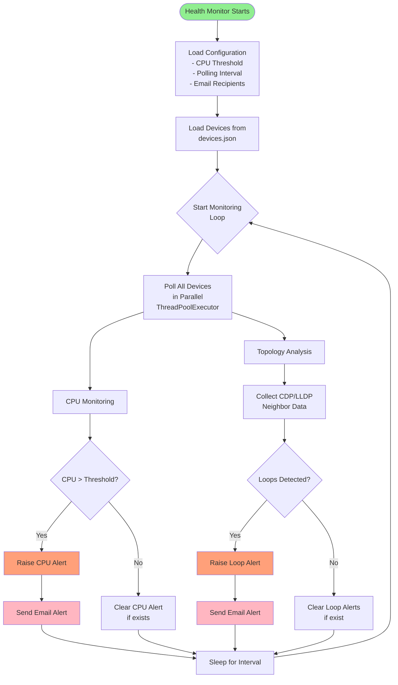
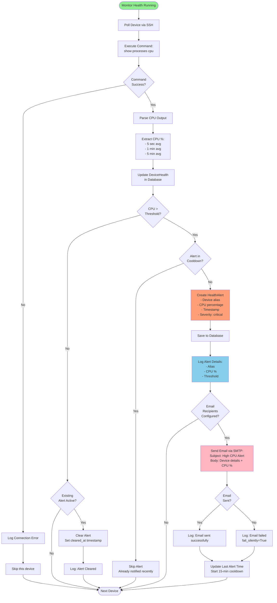
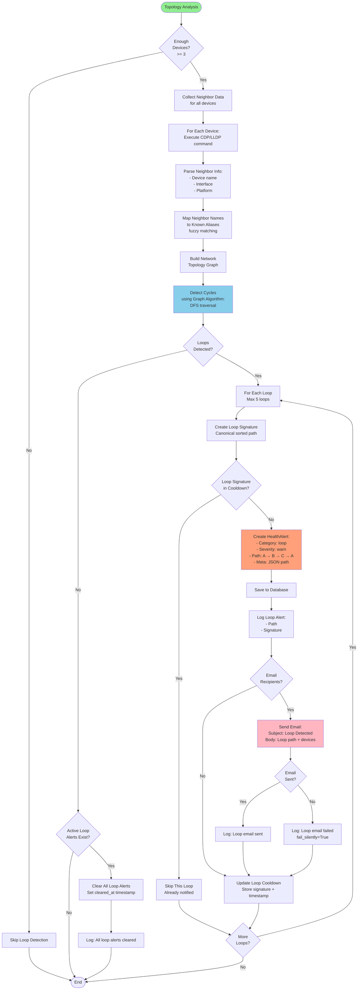
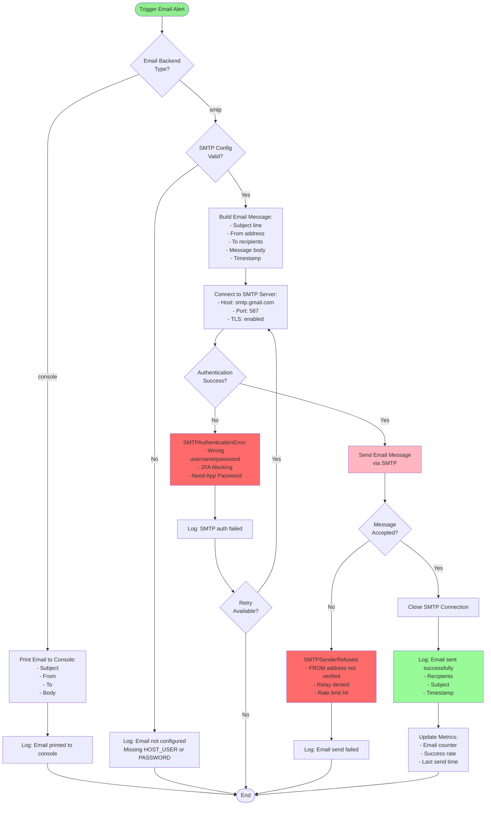
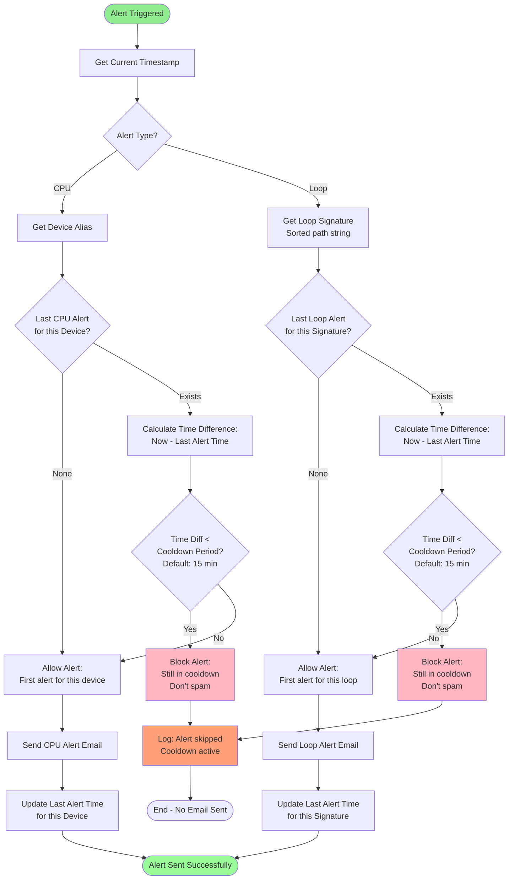
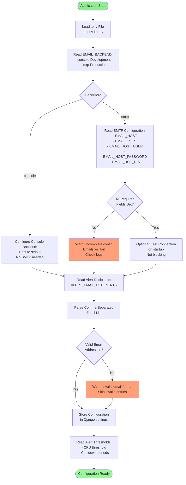
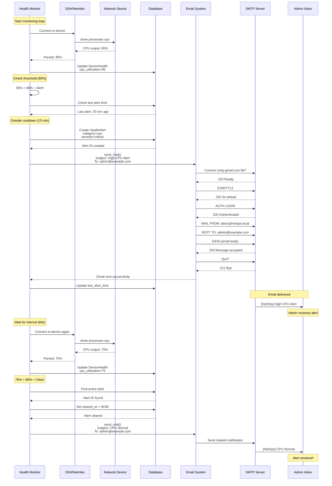
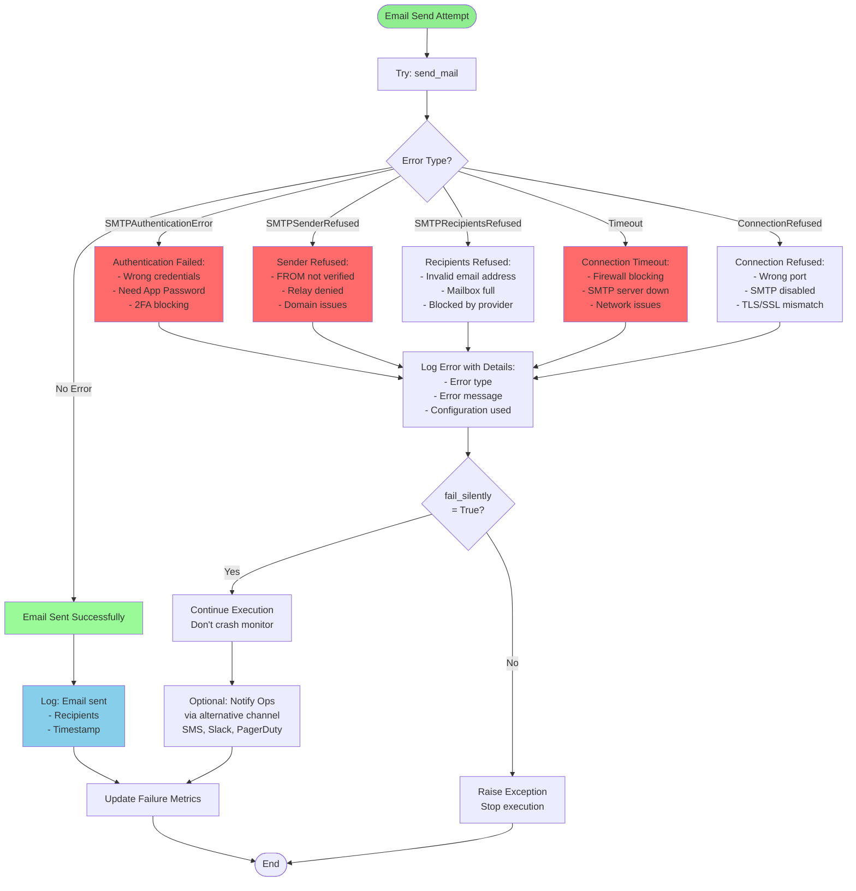
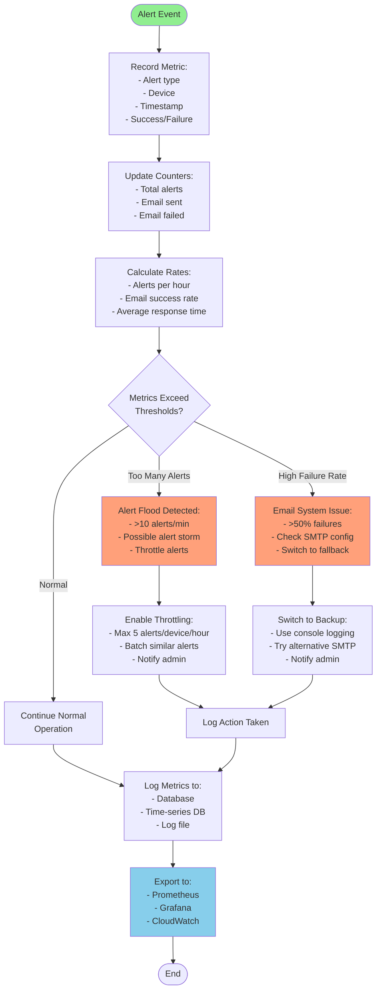
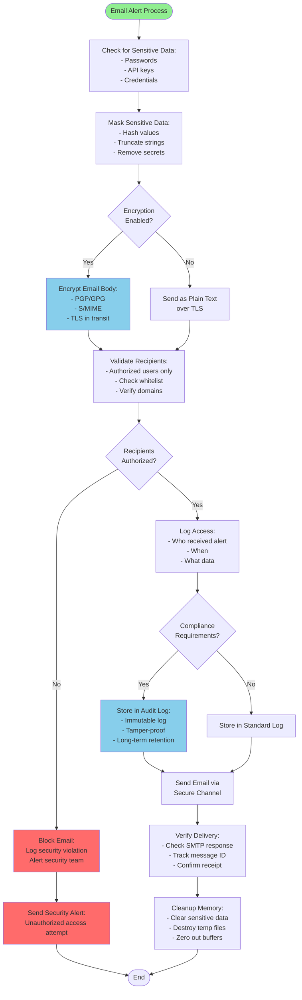

# Email Alert System - Flowcharts

This document contains visual flowcharts showing how the email alert system works in the Network Chatbot.

---

## 🔄 **Overall Email Alert System Architecture**



---

## 📊 **CPU Alert Flow - Detailed**



---

## 🔁 **Loop Detection Alert Flow - Detailed**



---

## 📧 **Email Sending Process - Detailed**



---

## 🔄 **Alert Cooldown & Deduplication Logic**



---

## 📨 **Email Content Generation**

```mermaid
flowchart TD
    Start([Generate Email]) --> GetAlertType{Alert Type?}
    
    GetAlertType -->|CPU| BuildCPUSubject[Subject:<br/>[NetOps] High CPU Alert - DEVICE_ALIAS]
    GetAlertType -->|Loop| BuildLoopSubject[Subject:<br/>[NetOps] Possible Loop Detected]
    
    BuildCPUSubject --> BuildCPUBody[Body:<br/>Device: ALIAS HOST<br/>Location: LOCATION<br/>CPU: XX%<br/>Threshold: XX%<br/>Time: TIMESTAMP<br/><br/>Action Required:<br/>1. Check processes<br/>2. Investigate tasks<br/>3. Consider upgrade]
    
    BuildLoopSubject --> BuildLoopBody[Body:<br/>Potential loop via:<br/>DEVICE1 → DEVICE2 → DEVICE3 → DEVICE1<br/><br/>Affected Devices:<br/>- DEVICE1 IP1<br/>- DEVICE2 IP2<br/>- DEVICE3 IP3<br/><br/>Recommended Actions:<br/>1. Check STP config<br/>2. Verify port states<br/>3. Check bridge IDs]
    
    BuildCPUBody --> SetFrom[Set FROM Address:<br/>ALERT_EMAIL_FROM env var<br/>Default: alerts@netops.local]
    BuildLoopBody --> SetFrom
    
    SetFrom --> SetRecipients[Set TO Recipients:<br/>1. Command line --email args<br/>2. ALERT_EMAIL_RECIPIENTS env<br/>3. Email passed to monitor_health]
    
    SetRecipients --> ValidateRecipients{Recipients<br/>Valid?}
    
    ValidateRecipients -->|No| LogNoRecipients[Log: No recipients configured<br/>Skip email]
    ValidateRecipients -->|Yes| FormatMessage[Format Email Message:<br/>- Plain text<br/>- UTF-8 encoding<br/>- Standard MIME headers]
    
    LogNoRecipients --> End([End])
    
    FormatMessage --> AddMetadata[Add Metadata:<br/>- Message-ID<br/>- Date header<br/>- X-Priority: High for critical]
    
    AddMetadata --> SendToSMTP[Pass to Django<br/>send_mail Function]
    
    SendToSMTP --> End([Return Email Object])
    
    style Start fill:#90EE90
    style SendToSMTP fill:#87CEEB
    style LogNoRecipients fill:#FFA07A
```

---

## 🔧 **Configuration Flow**



---

## 🎯 **Complete Alert Lifecycle**



---

## 🚨 **Error Handling Flow**



---

## 📊 **Alert Metrics & Monitoring**



---

## 🔐 **Security & Privacy Flow**



---

## 📝 **Summary of Alert Types**

| Alert Type | Trigger | Cooldown | Auto-Clear | Email Subject |
|------------|---------|----------|------------|---------------|
| **CPU High** | CPU > 80% (configurable) | 15 minutes | Yes, when CPU < threshold | `[NetOps] High CPU Alert - DEVICE` |
| **Network Loop** | Loop detected in topology | 15 minutes | Yes, when loop resolves | `[NetOps] Possible Loop Detected` |
| **Device Down** | Connection timeout | 10 minutes | Yes, when device responds | `[NetOps] Device Unreachable - DEVICE` |
| **Health Check Fail** | Monitor process error | 5 minutes | No (manual) | `[NetOps] Health Monitor Error` |

---

## 🎯 **Key Decision Points in Flowcharts**

1. **Alert Cooldown Check**: Prevents alert spam by enforcing minimum time between alerts
2. **Email Backend Selection**: Determines console (dev) vs SMTP (prod) delivery
3. **Configuration Validation**: Ensures all required settings before attempting send
4. **Loop Deduplication**: Uses canonical signature to prevent duplicate loop alerts
5. **Error Handling**: Graceful degradation with fail_silently=True
6. **Auto-Clear Logic**: Automatically clears alerts when conditions normalize

---

## 💡 **How to Read These Flowcharts**

- **Green boxes**: Start/success states
- **Red/Pink boxes**: Alert conditions or email actions
- **Blue boxes**: Data processing or logging
- **Orange boxes**: Warning/error conditions
- **Diamond shapes**: Decision points
- **Rounded boxes**: External systems (SMTP, database)

---

## 🔗 **Related Documentation**

- **Email Setup**: `Backend/EMAIL_SETUP_GUIDE.md`
- **Configuration**: `Backend/EMAIL_CONFIGURATION_SUMMARY.md`
- **Testing**: Run `python Backend/netops_backend/test_email.py`
- **Monitor Command**: `python manage.py monitor_health --help`

---

**Generated:** October 18, 2025  
**Version:** 1.0  
**Status:** Complete and ready for implementation
