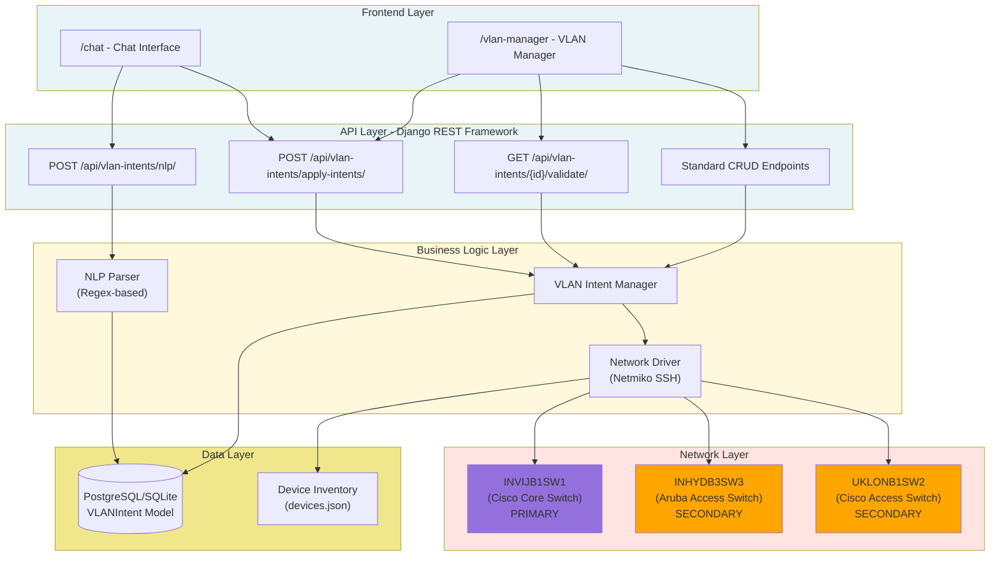

# System Architecture Diagram

```mermaid
graph TB
    subgraph Frontend["Frontend Layer"]
        Chat["/chat - Chat Interface"]
        Manager["/vlan-manager - VLAN Manager"]
    end
    
    subgraph API["API Layer - Django REST Framework"]
        NLP_API["POST /api/vlan-intents/nlp/"]
        Apply_API["POST /api/vlan-intents/apply-intents/"]
        Validate_API["GET /api/vlan-intents/{id}/validate/"]
        CRUD_API["Standard CRUD Endpoints"]
    end
    
    subgraph Logic["Business Logic Layer"]
        NLP_Parser["NLP Parser<br/>(Regex-based)"]
        Intent_Manager["VLAN Intent Manager"]
        Driver["Network Driver<br/>(Netmiko SSH)"]
    end
    
    subgraph Data["Data Layer"]
        DB[("PostgreSQL/SQLite<br/>VLANIntent Model")]
        Inventory["Device Inventory<br/>(devices.json)"]
    end
    
    subgraph Network["Network Layer"]
        Core["INVIJB1SW1<br/>(Cisco Core Switch)<br/>PRIMARY"]
        Access1["INHYDB3SW3<br/>(Aruba Access Switch)<br/>SECONDARY"]
        Access2["UKLONB1SW2<br/>(Cisco Access Switch)<br/>SECONDARY"]
    end
    
    Chat --> NLP_API
    Chat --> Apply_API
    Manager --> Apply_API
    Manager --> Validate_API
    Manager --> CRUD_API
    
    NLP_API --> NLP_Parser
    Apply_API --> Intent_Manager
    Validate_API --> Intent_Manager
    CRUD_API --> Intent_Manager
    
    NLP_Parser --> DB
    Intent_Manager --> DB
    Intent_Manager --> Driver
    
    Driver --> Inventory
    Driver --> Core
    Driver --> Access1
    Driver --> Access2
    
    style Core fill:#9370DB
    style Access1 fill:#FFA500
    style Access2 fill:#FFA500
    style Frontend fill:#E8F4F8
    style API fill:#E8F4F8
    style Logic fill:#FFF8DC
    style Data fill:#F0E68C
    style Network fill:#FFE4E1
```

**Usage**: Copy this into [Mermaid Live Editor](https://mermaid.live/) or any Mermaid-compatible tool.
