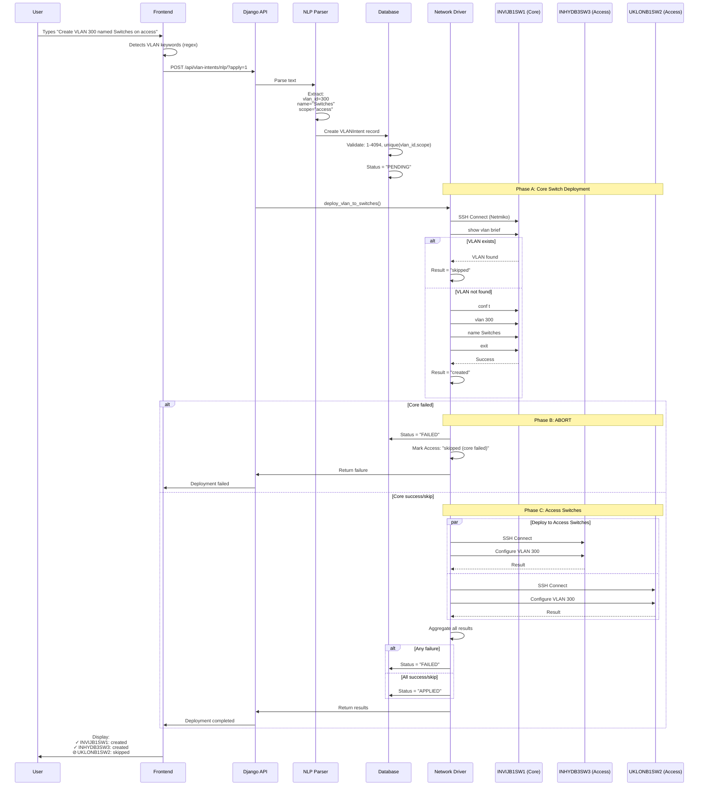

# End-to-End User Flow

```mermaid
sequenceDiagram
    participant User
    participant Frontend
    participant API as Django API
    participant NLP as NLP Parser
    participant DB as Database
    participant Driver as Network Driver
    participant Core as INVIJB1SW1 (Core)
    participant Access1 as INHYDB3SW3 (Access)
    participant Access2 as UKLONB1SW2 (Access)
    
    User->>Frontend: Types "Create VLAN 300 named Switches on access"
    Frontend->>Frontend: Detects VLAN keywords (regex)
    Frontend->>API: POST /api/vlan-intents/nlp/?apply=1
    
    API->>NLP: Parse text
    NLP->>NLP: Extract:<br/>vlan_id=300<br/>name="Switches"<br/>scope="access"
    NLP->>DB: Create VLANIntent record
    DB->>DB: Validate: 1-4094, unique(vlan_id,scope)
    DB->>DB: Status = "PENDING"
    
    Note over Driver,Access2: Phase A: Core Switch Deployment
    API->>Driver: deploy_vlan_to_switches()
    Driver->>Core: SSH Connect (Netmiko)
    Driver->>Core: show vlan brief
    
    alt VLAN exists
        Core-->>Driver: VLAN found
        Driver->>Driver: Result = "skipped"
    else VLAN not found
        Driver->>Core: conf t
        Driver->>Core: vlan 300
        Driver->>Core: name Switches
        Driver->>Core: exit
        Core-->>Driver: Success
        Driver->>Driver: Result = "created"
    end
    
    alt Core failed
        Note over Driver,Access2: Phase B: ABORT
        Driver->>DB: Status = "FAILED"
        Driver->>Driver: Mark Access: "skipped (core failed)"
        Driver->>API: Return failure
        API->>Frontend: Deployment failed
    else Core success/skip
        Note over Driver,Access2: Phase C: Access Switches
        par Deploy to Access Switches
            Driver->>Access1: SSH Connect
            Driver->>Access1: Configure VLAN 300
            Access1-->>Driver: Result
        and
            Driver->>Access2: SSH Connect
            Driver->>Access2: Configure VLAN 300
            Access2-->>Driver: Result
        end
        
        Driver->>Driver: Aggregate all results
        
        alt Any failure
            Driver->>DB: Status = "FAILED"
        else All success/skip
            Driver->>DB: Status = "APPLIED"
        end
        
        Driver->>API: Return results
        API->>Frontend: Deployment completed
    end
    
    Frontend->>User: Display:<br/>✓ INVIJB1SW1: created<br/>✓ INHYDB3SW3: created<br/>⊘ UKLONB1SW2: skipped
```

**Usage**: Copy this into [Mermaid Live Editor](https://mermaid.live/) for a detailed sequence diagram.
