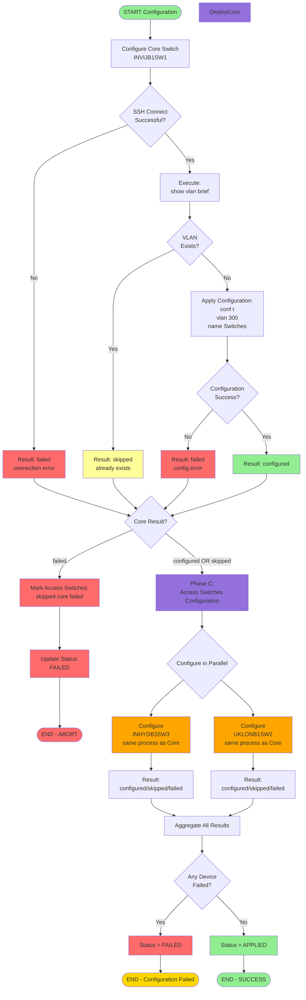

# Hierarchical Configuration Logic

```mermaid
flowchart TD
    Start([START Configuration]) --> ConfigCore[Configure Core Switch<br/>INVIJB1SW1]
    
    ConfigCore --> CoreSSH{SSH Connect<br/>Successful?}
    CoreSSH -->|No| CoreFailed[Result: failed<br/>connection error]
    CoreSSH -->|Yes| CoreCheck[Execute:<br/>show vlan brief]
    
    CoreCheck --> CoreExists{VLAN<br/>Exists?}
    CoreExists -->|Yes| CoreSkip[Result: skipped<br/>already exists]
    CoreExists -->|No| CoreConfig[Apply Configuration:<br/>conf t<br/>vlan 300<br/>name Switches]
    
    CoreConfig --> CoreConfigOk{Configuration<br/>Success?}
    CoreConfigOk -->|No| CoreConfigFailed[Result: failed<br/>config error]
    CoreConfigOk -->|Yes| CoreCreated[Result: configured]
    
    CoreFailed --> DecisionCore{Core Result?}
    CoreConfigFailed --> DecisionCore
    CoreSkip --> DecisionCore
    CoreCreated --> DecisionCore
    
    DecisionCore -->|failed| AbortFlow[Mark Access Switches:<br/>skipped core failed]
    AbortFlow --> UpdateFailed[Update Status:<br/>FAILED]
    UpdateFailed --> EndAbort([END - ABORT])
    
    DecisionCore -->|configured OR skipped| PhaseC[Phase C:<br/>Access Switches Configuration]
    
    PhaseC --> ParallelStart{Configure in Parallel}
    
    ParallelStart --> Access1[Configure<br/>INHYDB3SW3<br/>same process as Core]
    ParallelStart --> Access2[Configure<br/>UKLONB1SW2<br/>same process as Core]
    
    Access1 --> Access1Result[Result:<br/>configured/skipped/failed]
    Access2 --> Access2Result[Result:<br/>configured/skipped/failed]
    
    Access1Result --> Aggregate[Aggregate All Results]
    Access2Result --> Aggregate
    
    Aggregate --> AnyFailed{Any Device<br/>Failed?}
    
    AnyFailed -->|Yes| StatusFailed[Status = FAILED]
    AnyFailed -->|No| StatusApplied[Status = APPLIED]
    
    StatusFailed --> EndSuccess([END - Configuration Failed])
    StatusApplied --> EndSuccess2([END - SUCCESS])
    
    style Start fill:#90EE90
    style DeployCore fill:#9370DB
    style PhaseC fill:#9370DB
    style Access1 fill:#FFA500
    style Access2 fill:#FFA500
    style CoreCreated fill:#90EE90
    style CoreSkip fill:#FFFF99
    style CoreFailed fill:#FF6B6B
    style CoreConfigFailed fill:#FF6B6B
    style AbortFlow fill:#FF6B6B
    style UpdateFailed fill:#FF6B6B
    style StatusFailed fill:#FF6B6B
    style StatusApplied fill:#90EE90
    style EndAbort fill:#FF6B6B
    style EndSuccess fill:#FFD700
    style EndSuccess2 fill:#90EE90
```

**Usage**: Copy this into [Mermaid Live Editor](https://mermaid.live/) to see the complete configuration decision tree.
