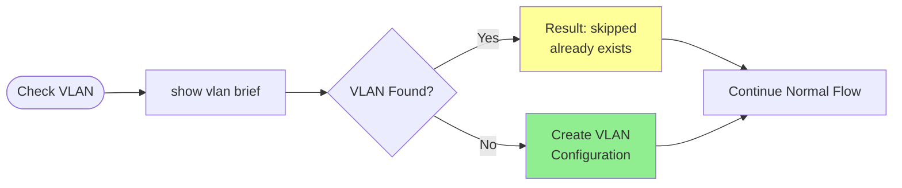
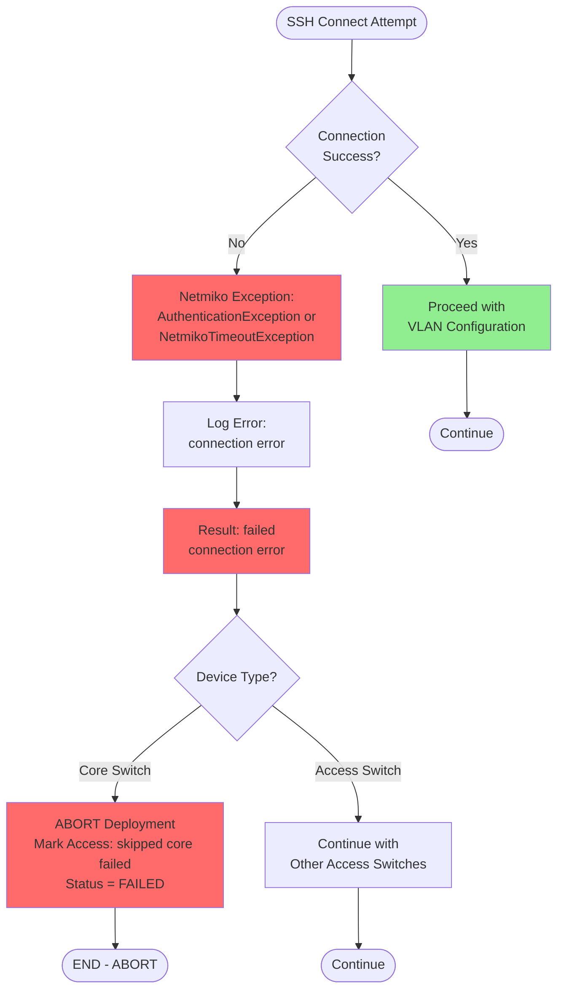
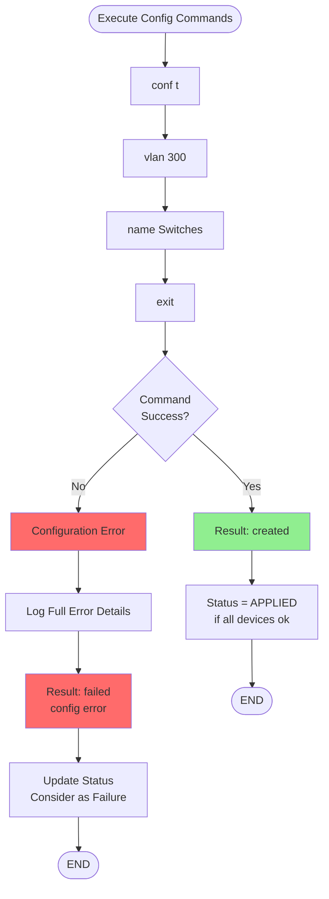
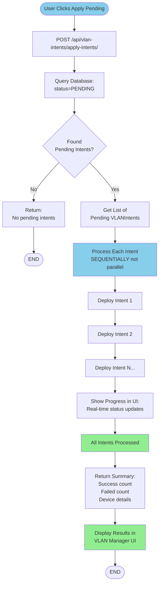

# Special Cases Flow

## Case 1: VLAN Already Exists

## Case 2: SSH Connection Failure

## Case 3: Configuration Error

## Case 4: Batch Apply from Manager UI

**Usage**: Copy each section into [Mermaid Live Editor](https://mermaid.live/) separately to visualize different special cases.
