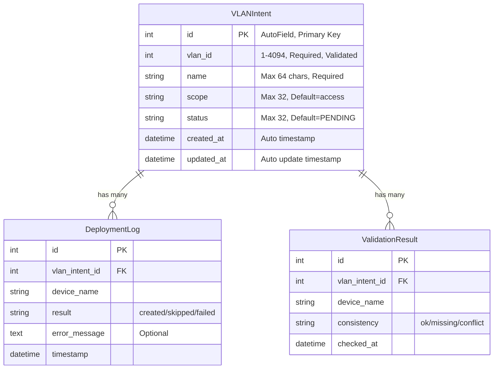
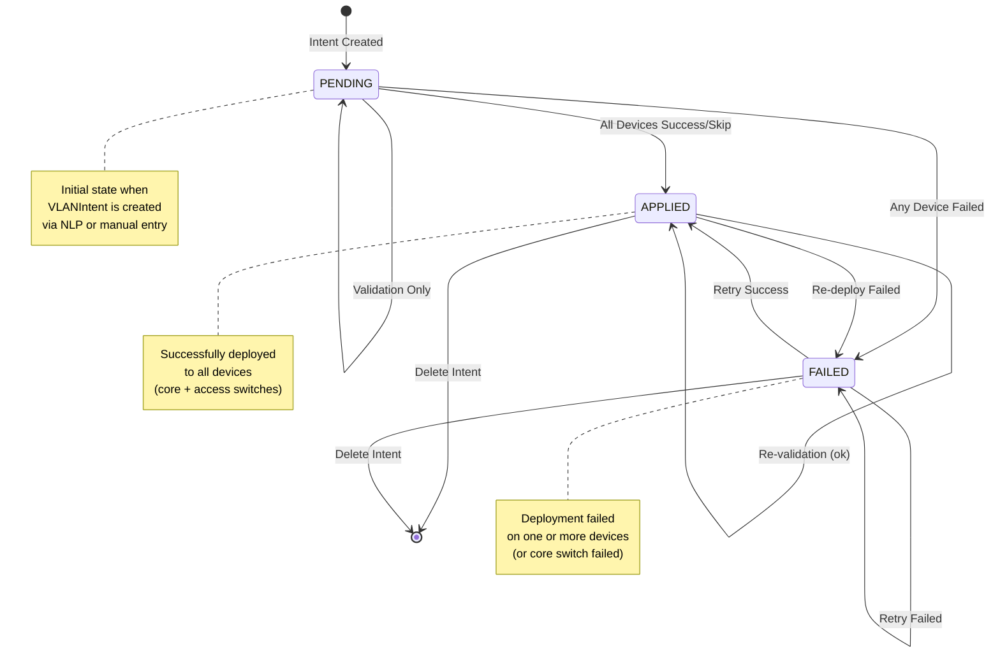
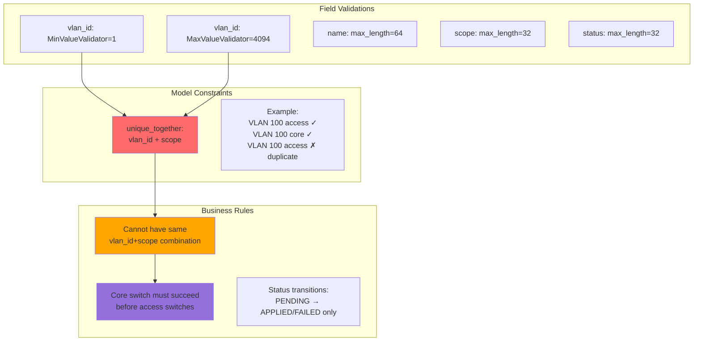

# Data Model (VLANIntent)

## Status State Machine

## Constraints & Validations

**Usage**: Copy sections into [Mermaid Live Editor](https://mermaid.live/) to visualize the database schema and relationships.
